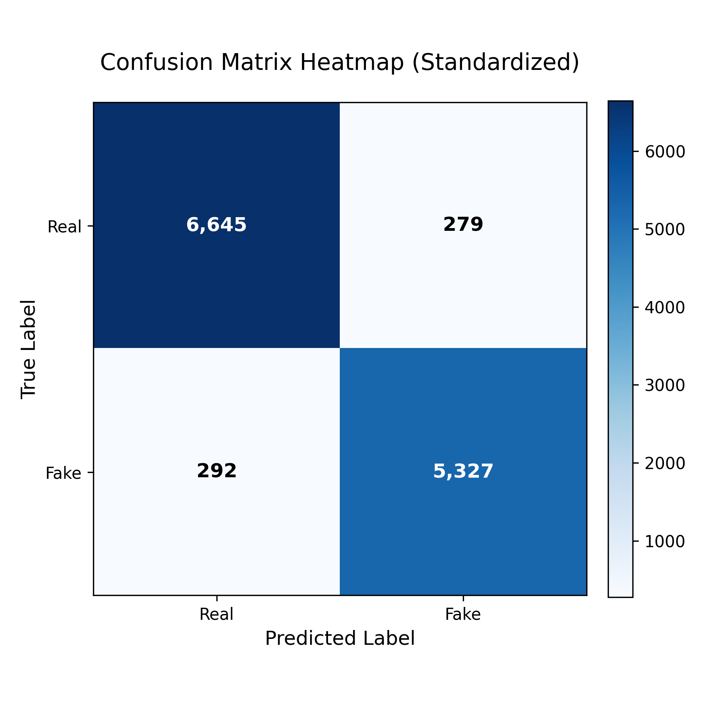
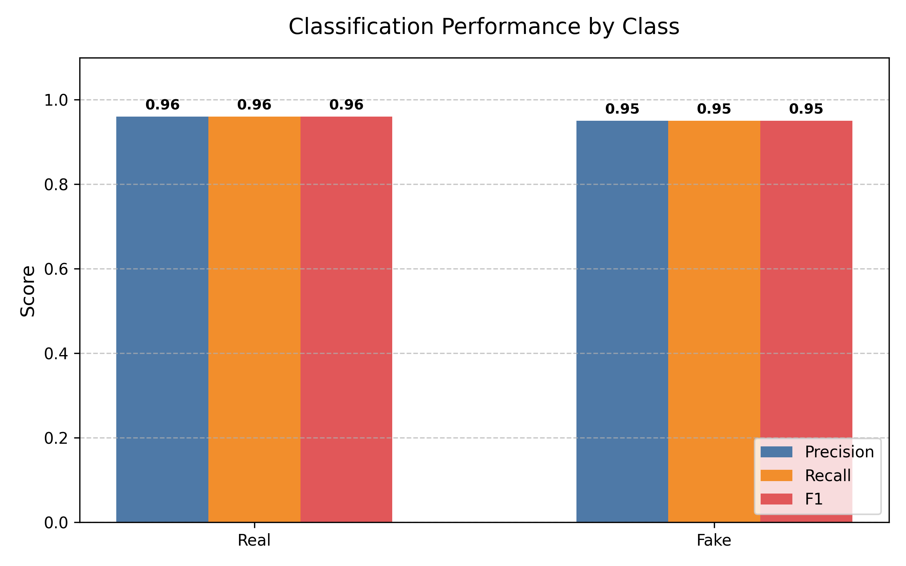

# Best Model Report: LinearSVC

Generated on: 20260125_212432

## 1. Dataset & Preprocessing

Source file: WELFake_Dataset.csv
Label inversion applied (original labels flipped so internal mapping 0=Real,1=Fake).
Preprocessing: drop NaN (text/label), remove empty texts, remove duplicate texts (first kept).

### Statistics
- Raw rows: 72134
- Final rows: 62715
- Dropped NaN: 39
- Empties removed: 744
- Duplicates removed: 8636
- Label distribution (0=Real,1=Fake): {0: 34620, 1: 28095}

## 2. Split

Train: 50172 | Test: 12543 (test_fraction=0.2, stratified=True)

## 3. TF-IDF

Params: stop_words='english', max_df=0.7
Vocab size: 243186

## 4. Model & Hyperparameters

Model: LinearSVC
- C: 1.0
- dual: False
- max_iter: 1000
- penalty: l2
- random_state: 42
- epochs: N/A (non-neural)

## 5. Training

Training time: 2.08 s

## 6. Evaluation

Accuracy: 0.9545
Confusion Matrix (rows=true [Real, Fake], cols=pred):
``
[[6645, 279], [292, 5327]]
``


Classification Report:
```
              precision    recall  f1-score   support

        Real       0.96      0.96      0.96      6924
        Fake       0.95      0.95      0.95      5619

    accuracy                           0.95     12543
   macro avg       0.95      0.95      0.95     12543
weighted avg       0.95      0.95      0.95     12543
```

## 7. Environment

- Platform: Linux-6.11.0-28-generic-x86_64-with-glibc2.39
- Python Version: 3.13.11
- Processor: x86_64
- GPU: None or not used

## 8. Reproducibility

1. Run training script (random_state=42).
2. Keep same TF-IDF params & preprocessing.
3. Check run_metadata.json label mapping.