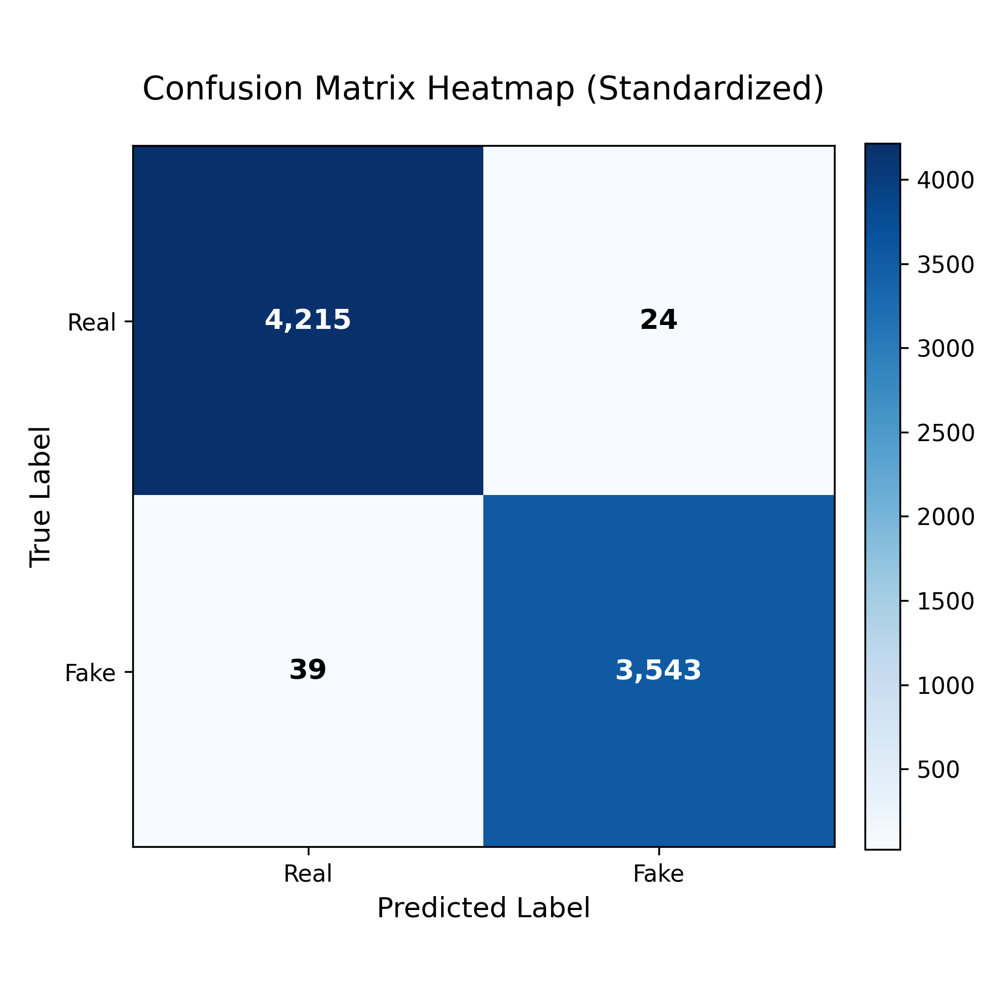
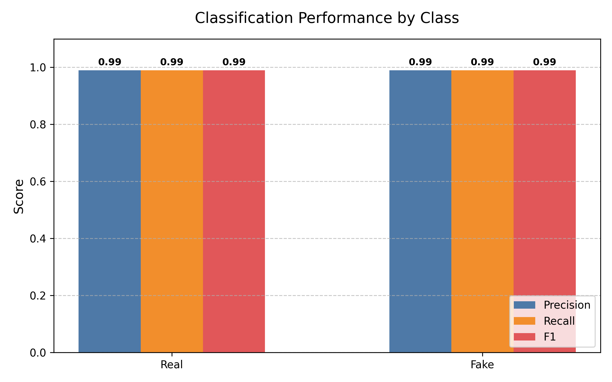

# Best Model Report: LinearSVC

Generated on: 20260128_221955

## 1. Dataset & Preprocessing

Source file: combined_TF_data.csv
Label inversion applied (original labels flipped so internal mapping 0=Real,1=Fake).
Preprocessing: drop NaN (text/label), remove empty texts, remove duplicate texts (first kept).

### Statistics
- Raw rows: 39105
- Final rows: 39105
- Dropped NaN: 0
- Empties removed: 0
- Duplicates removed: 0
- Label distribution (0=Real,1=Fake): {0: 21197, 1: 17908}

## 2. Split

Train: 31284 | Test: 7821 (test_fraction=0.2, stratified=True)

## 3. TF-IDF

Params: stop_words='english', max_df=0.7
Vocab size: 122200

## 4. Model & Hyperparameters

Model: LinearSVC
- C: 1.0
- dual: False
- max_iter: 1000
- penalty: l2
- random_state: 42
- epochs: N/A (non-neural)

## 5. Training

Training time: 0.76 s

## 6. Evaluation

Accuracy: 0.9919
Confusion Matrix (rows=true [Real, Fake], cols=pred):
``
[[4215, 24], [39, 3543]]
``


Classification Report:
```
              precision    recall  f1-score   support

        Real       0.99      0.99      0.99      4239
        Fake       0.99      0.99      0.99      3582

    accuracy                           0.99      7821
   macro avg       0.99      0.99      0.99      7821
weighted avg       0.99      0.99      0.99      7821
```

## 7. Environment

- Platform: Linux-6.11.0-28-generic-x86_64-with-glibc2.39
- Python Version: 3.14.2
- Processor: x86_64
- GPU: None or not used

## 8. Reproducibility

1. Run training script (random_state=42).
2. Keep same TF-IDF params & preprocessing.
3. Check run_metadata.json label mapping.